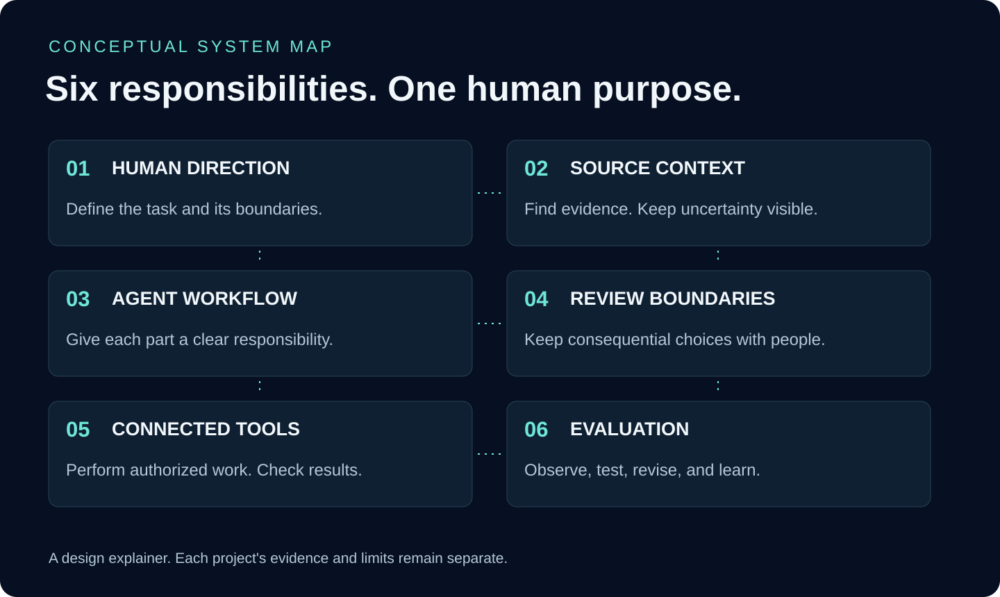

# 🛰️ How the parts connect

**Conceptual architecture · personal development project**

| Responsibility | The useful question |
| --- | --- |
| Human direction | What is the actual task, and what would a useful result look like? |
| Source context | Which records support this work, and what is missing? |
| Agent workflow | Who or what handles each bounded part of the task? |
| Review boundaries | Does the next action require the person's decision? |
| Connected tools | What authorized action will a tool perform, and what result did it return? |
| Evaluation | Which behavior was checked, which result was observed, and what should change? |

The map explains responsibilities, not a live system-health state. A written boundary does not establish universal enforcement. Retrieved records can be stale, agent output can be wrong, and a connected tool can fail.

## Applying the map to paperwork

In the [fictional notice walkthrough](notice-to-plan.md), the person sets the goal, the notice provides the known facts, the workflow produces a checklist, uncertainties return for clarification, and the person decides whether to take an external action. This is an illustration of the design, not proof of a deployed administrative-support product.

[Interactive workflow illustration](https://arcturiongroup.com/work/arcturion-universe#demonstration) · [Mission](mission.md)
