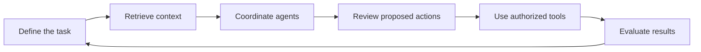

# Arcturion Technologies

**A personal development project exploring applied AI, agent systems, and automation.**

This GitHub organization is a place to showcase and share what we build, test, and learn. Our work explores how software, shared knowledge, AI agents, and human judgment can fit together around practical tasks.

**Personal project · AI-assisted development · Work in progress**

[Explore the website](https://arcturiongroup.com) · [Inspect the architecture](https://arcturiongroup.com/architecture)

## Work you can explore

| Project | What it demonstrates |
| --- | --- |
| [The Arcturion Universe](https://arcturiongroup.com/work/arcturion-universe) | Shared context, specialized agent responsibilities, and human review. Includes an interactive workflow illustration with synthetic data; no live model calls or external actions. |
| [Arcturion Finance](https://arcturiongroup.com/work/arcturion-finance) | A personal accounting application project, with recorded backend outputs for categorization, reconciliation, and reporting using synthetic records. |
| [System architecture](https://arcturiongroup.com/architecture) | An explorable design connecting knowledge, agent workflows, approval boundaries, tools, and evaluation. |
| [Dark Ascendant web project](https://github.com/ArcturionTechnologies/darkascendant-web) | Public source for a digital product landing page. |

## What we are exploring

- **Agent systems:** shared context, memory, task coordination, and tool integrations.
- **Automation:** connecting practical workflows to files, applications, and services.
- **Governance and evaluation:** human approval boundaries, traceable decisions, and checks on system behavior.
- **Software and web development:** applications, websites, and digital product experiments.

## How the parts connect

*A conceptual workflow. Each linked project explains its demonstration, evidence, and current limitations.*

## How we build and share

Our Founder defines requirements, shapes the architecture, directs AI coding tools, and reviews the results. Implementation is AI-assisted.

We use this space to share selected projects, reusable ideas, documented results, and lessons from development. Demonstrations are labeled to show whether they are illustrations or recorded application outputs.

**Website:** [arcturiongroup.com](https://arcturiongroup.com)  
**Founder:** [Robert Lingoes](https://github.com/Robert-ArcturionTech)
